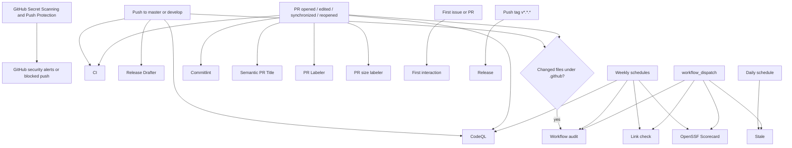
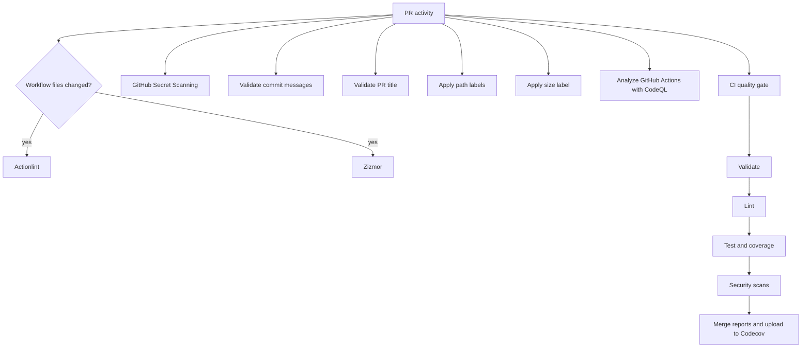
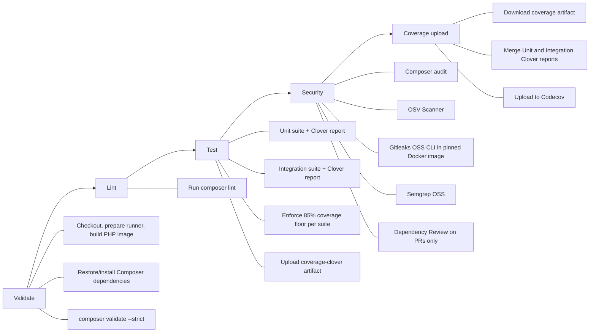
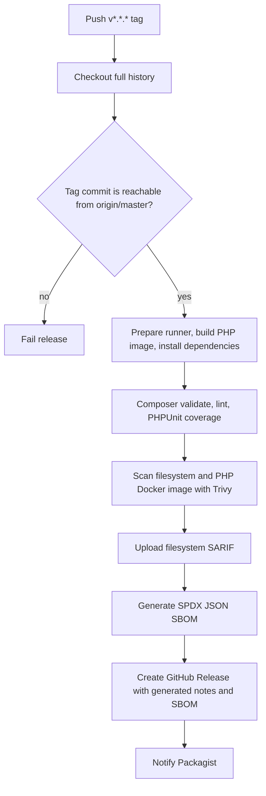

# GitHub Actions workflow flow

This document describes the workflows currently defined in
`.github/workflows/`. All jobs run on the self-hosted `runner1` Linux X64
runner. PHP-related commands run through the repository Docker Compose setup.

## Overall event flow

## Pull request flow

The CI and PR-policy workflows are independent: a label or title check does
not wait for CI, and CI does not wait for those checks.

## CI (`ci.yml`)

**Triggers:** push or pull request targeting `master` or `develop`.
Concurrent runs for the same Git ref cancel older in-progress runs.

Each CI job repairs prior Docker-owned workspace files, checks out the source,
prepares the self-hosted Docker environment, builds the PHP image, and restores
or installs Composer dependencies as needed. `security` and `coverage` check
out full Git history.

## Release flow (`release.yml`)

**Trigger:** push of a tag matching `v*.*.*`. Runs are not cancelled.

The workflow fails if the tag is not on `origin/master`, or if Packagist
credentials are unavailable. It is therefore the publication path; do not tag
until the owner approves the `v3.0.0` release.

## Other workflows

| Workflow | Trigger | Flow / result |
| --- | --- | --- |
| `codeql.yml` | Push/PR on `master` or `develop`; Monday 06:00 UTC | Checkout → initialize CodeQL for GitHub Actions only → analyze and publish security results. |
| `commitlint.yml` | PR opened, edited, synchronized, reopened | Checkout full history → validate every PR commit against `.github/commitlint.config.mjs`. |
| `semantic-pr.yml` | PR opened, edited, synchronized | Validate PR title type and require an uppercase first subject character. |
| `pr-labeler.yml` | PR opened, synchronized, reopened | Checkout → apply labels from `.github/labeler.yml` based on changed paths. |
| `pr-size-labeler.yml` | PR opened, synchronized, reopened | Checkout → apply `size/XS` through `size/XXL` based on changed-line thresholds. |
| `first-interaction.yml` | First issue or PR opened | Post contributor welcome message and contribution/security guidance. |
| `release-drafter.yml` | Push to `develop` or `master` | Checkout → update draft release notes using `.github/release-drafter.yml`. |
| `link-check.yml` | Monday 04:00 UTC; manual | Checkout → Lychee checks Markdown links, excluding `vendor`, Packagist, Codecov, and mail links. |
| `scorecard.yml` | Push to `master`; Monday 00:00 UTC; manual | Checkout full history → OpenSSF Scorecard → upload SARIF. |
| `stale.yml` | Daily 01:00 UTC; manual | Mark issues/PRs stale after 60 inactive days; close 14 days later, except pinned/security/dependencies. |
| `workflow-audit.yml` | `.github/**` changes on push/PR; Monday 03:00 UTC; manual | Runs independent jobs: Actionlint checks workflow syntax and Zizmor scans workflow security, then uploads Zizmor SARIF when produced. |

## Scheduled maintenance timeline

All cron expressions use UTC, not the runner's local timezone.

```mermaid
gantt
    title Scheduled workflows (UTC)
    dateFormat  HH:mm
    axisFormat  %H:%M
    section Monday
    OpenSSF Scorecard      :milestone, 00:00, 0m
    Stale (also daily)     :milestone, 01:00, 0m
    Workflow audit         :milestone, 03:00, 0m
    Link check             :milestone, 04:00, 0m
    CodeQL                 :milestone, 06:00, 0m
```

## Shared runner preparation

Most workflows first repair ownership of `vendor/` and `build/`, which can be
left root-owned by Docker. The PHP CI and release workflows additionally use
the local composite action `.github/actions/self-hosted-prepare` before
building or running the PHP container.

## Notes

- All declared workflows use dedicated repository configuration; none use
  `jooservices/workflows`.
- Secret scanning has two layers: GitHub Secret Scanning and Push Protection
  detect or block supported secrets at GitHub, while CI scans the checked-out
  Git history with the MIT-licensed Gitleaks OSS CLI. GitHub Secret Scanning
  and Push Protection are enabled in the repository security settings; they
  are not controlled by a workflow file.
- CI sends coverage only to Codecov. The README currently mentions Sonar in
  its CI chain, but no workflow uploads coverage to Sonar.
- Release is tag-driven, but its `origin/master` ancestry gate prevents a tag
  from publishing a commit that is not on the production branch.
